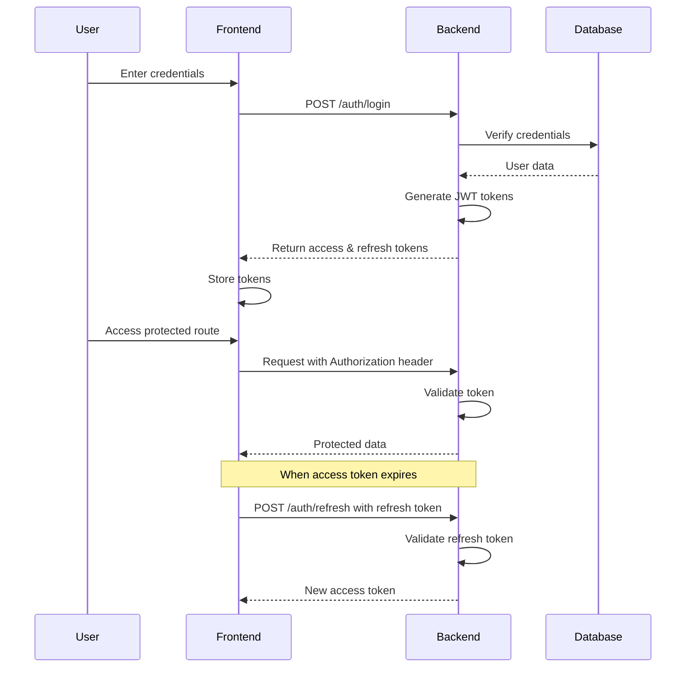

# 🔐 RS256 JWT Authentication System


A robust authentication system built with FastAPI and Vue.js, implementing JWT authentication with RS256 algorithm for enhanced security.

## ✨ Features

- **🔑 RS256 JWT Authentication** - Asymmetric cryptography for enhanced security
- **🔄 Token Rotation** - Access tokens and refresh tokens with automatic renewal
- **👤 User Management** - User profiles, authentication, and authorization
- **🛡️ Protected Routes** - Both backend and frontend route protection
- **🔒 Secure Password Handling** - Bcrypt hashing for password storage
- **🌐 RESTful API** - Clean API design with FastAPI
- **⚡ Modern Frontend** - Vue 3 with Composition API
- **🔌 State Management** - Vuex for global state management

## 🏗️ Architecture

### Backend (FastAPI)

```
backend/
├── app/
│   ├── auth/                # Authentication logic
│   │   ├── jwt_handler.py   # JWT generation and validation
│   │   └── routes.py        # Auth endpoints
│   ├── users/               # User management
│   │   ├── models.py        # User models
│   │   └── routes.py        # User endpoints
│   └── config.py            # App configuration
├── main.py                  # FastAPI app entry point
├── private_key.pem          # RS256 private key
└── public_key.pem           # RS256 public key
```

### Frontend (Vue.js)

```
frontend/
├── src/
│   ├── components/          # Reusable components
│   ├── views/               # Page components
│   ├── stores/               # Vuex state management
│   ├── router/              # Vue Router configuration
│   ├── services/            # API services
│   └── assets/              # Static assets
└── public/                  # Public static files
```

## 🚀 Getting Started

### Prerequisites

- Python 3.8+
- Node.js 16+
- npm or yarn

### Backend Setup

1. **Create a virtual environment**
   ```bash
   cd backend # Assuming you are in the project directory
   python -m venv venv
   source venv/bin/activate  # On Windows: venv\Scripts\activate
   ```

2. **Install dependencies**
   ```bash
   pip install -r requirements.txt
   ```

3. **Generate RSA keys**
   ```bash
   openssl genrsa -out private_key.pem 2048
   openssl rsa -in private_key.pem -pubout -out public_key.pem
   ```

4. **Run the server**
   ```bash
   uvicorn main:app --reload --port 8080
   ```

### Frontend Setup

1. **Install dependencies**
   ```bash
   cd frontend
   npm install
   ```

2. **Run development server**
   ```bash
   npm run dev
   ```

## 📝 API Documentation

Once the backend is running, access the interactive API documentation at:
- Swagger UI: http://localhost:8080/docs
- ReDoc: http://localhost:8080/redoc

## 🔐 Authentication Flow



## 🛡️ Security Considerations

- **Token Storage**: In production, consider storing tokens in HttpOnly cookies
- **Key Management**: Store private keys securely using environment variables or secret management services
- **Token Revocation**: Implement a token blacklist for immediate revocation when needed
- **Rate Limiting**: Add rate limiting to authentication endpoints to prevent brute force attacks
- **HTTPS**: Always use HTTPS in production environments

## 🔧 Configuration

### Backend Environment Variables

| Variable | Description | Default |
|----------|-------------|---------|
| `ACCESS_TOKEN_EXPIRE_MINUTES` | Access token lifetime | 30 |
| `REFRESH_TOKEN_EXPIRE_DAYS` | Refresh token lifetime | 7 |
| `ALGORITHM` | JWT algorithm | "RS256" |

## 📜 License

Distributed under the MIT License. See `LICENSE` for more information.

## 🙏 Acknowledgements

- [FastAPI](https://fastapi.tiangolo.com/)
- [Vue.js](https://vuejs.org/)
- [PassLib](https://passlib.readthedocs.io/)
- [python-jose](https://python-jose.readthedocs.io/en/latest/)
